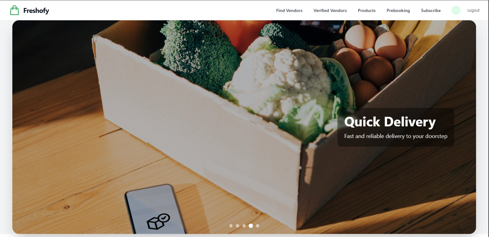
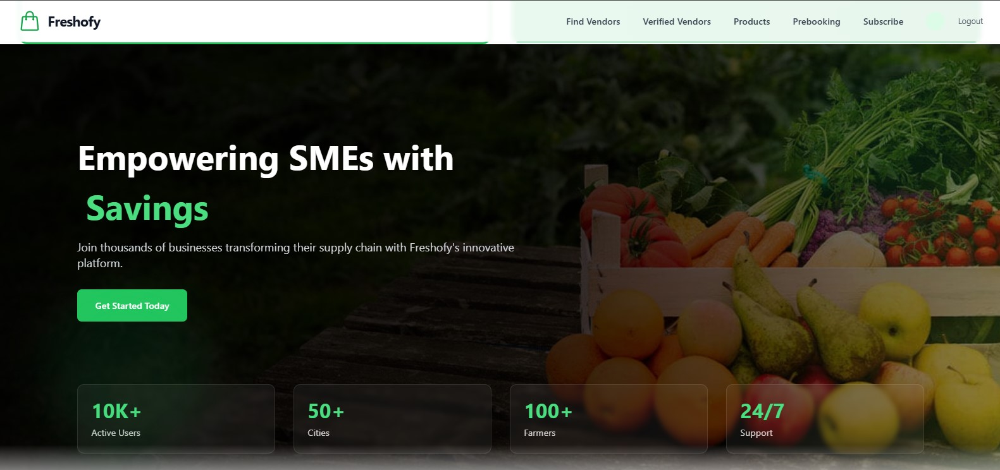
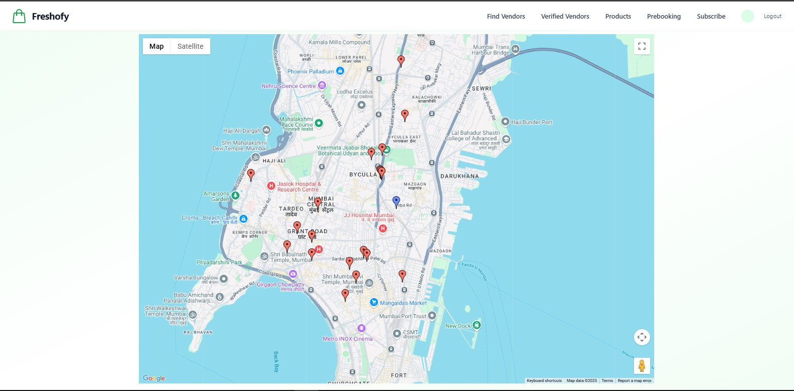
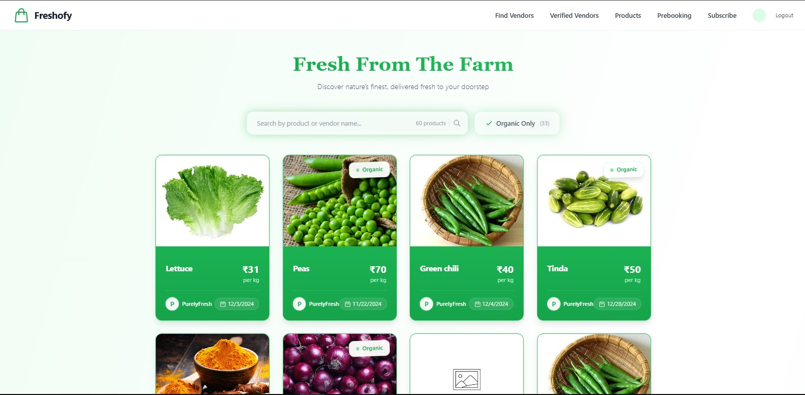
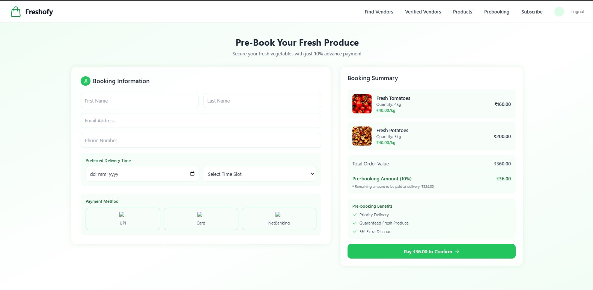
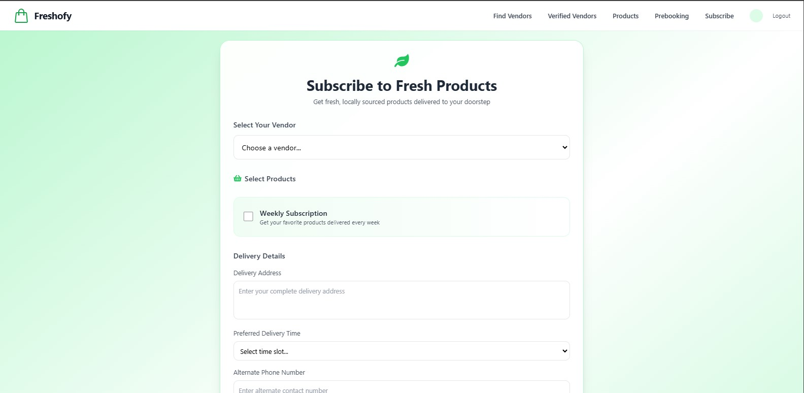

# Freshofy: Revolutionizing the Local Vegetable Market

## Overview

**Freshofy** is a trusted platform designed to bridge the gap between street vendors and customers, bringing a seamless and efficient shopping experience to local markets. By connecting consumers with verified vendors, providing real-time price updates, and enabling convenient prebooking options, Freshofy empowers users to save time, find the best deals, and contribute to a more sustainable and transparent market system.

## Problem Statement

In many local markets, customers often face difficulties in finding reliable vendors, navigating fluctuating prices, and dealing with the inefficiency of the shopping process. Vendors, on the other hand, struggle to reach a broader audience and manage orders effectively. Freshofy aims to solve these issues by creating an intuitive platform that connects customers to verified vendors, allowing them to track prices, prebook items, and enjoy a personalized shopping experience.

## Key Features

### 1. **Map of Local Vendors**

- Freshofy includes an interactive map that allows users to quickly locate nearby vegetable vendors. The map provides an easy way to browse local options, check vendor locations, and plan their shopping trips efficiently.

### 2. **Map of Verified Vendors**

- A dedicated section highlights vendors that have been verified by Freshofy. This ensures customers can confidently shop with trustworthy vendors, reducing the risk of poor quality or unethical practices.

### 3. **Timely Verification of Vendors**

- Freshofy ensures that all vendors are thoroughly vetted through a verification process, providing customers with up-to-date and reliable information. Regular checks are performed to ensure vendors maintain quality and fairness.

### 4. **Periodic Order Subscriptions from Vendors**

- Users can subscribe to periodic orders for their favorite vegetables, ensuring they never run out of fresh produce. Subscriptions are flexible, allowing users to choose delivery frequency, quantities, and preferred items.

### 5. **Prebooking Orders**

- With Freshofy, customers can prebook their orders in advance, ensuring that their desired vegetables are reserved for pickup or delivery. This feature minimizes cancellations and streamlines the entire shopping process, making it more convenient for both customers and vendors.

### 6. **E-Commerce for Vendors**

- Freshofy includes an integrated e-commerce platform for vendors, allowing them to list their products online. Vendors can manage their stock, update prices in real-time, and offer discounts or promotions directly through the platform, reaching a wider audience.

### 7. **Personalized Suggestions**

- Based on customer preferences, Freshofy provides personalized vegetable recommendations. These suggestions focus on healthy, seasonal options, helping users make better dietary choices and discover new products they might love.

### 8. **Real-Time Price Updates**

- Vendors can update their vegetable prices in real-time, ensuring that customers always have access to the most accurate and transparent pricing information. This feature helps to reduce confusion and allows users to make informed purchasing decisions.

### 9. **Vendor Rating System**

- Freshofy features a vendor rating system where customers can leave feedback based on product quality, price, and service. This transparent system encourages vendors to maintain high standards and gives customers confidence in their purchasing decisions.

### 10. **Market Crowd Density Updates**

- To help users plan their visits effectively, Freshofy provides real-time updates on market crowd density. This feature helps customers avoid peak hours, ensuring a more comfortable and efficient shopping experience.

### 11. **Waste Reduction through Pickup Reporting**

- Vendors can report unsold items at the end of the day for efficient pickup, reducing food waste and promoting sustainability. Freshofy partners with local organizations to ensure that excess produce is donated to those in need or repurposed.

### 12. **Vendor Dashboard**

- Vendors have access to a comprehensive dashboard that offers valuable sales insights, trending item analysis, and customer feedback. This helps vendors improve their offerings, manage their inventory more effectively, and stay competitive in the market.

## Project Screenshots

## How Freshofy Benefits Users and Vendors

- **For Customers**:

  - **Convenience**: Easily find and connect with nearby vendors, make preorders, and manage subscriptions.
  - **Transparency**: Stay informed with real-time price updates, vendor ratings, and detailed product descriptions.
  - **Personalization**: Receive tailored recommendations for healthy and seasonal vegetables, enhancing the shopping experience.
  - **Time-Saving**: Plan visits based on crowd density and prebook orders to avoid long queues and wasted time.

- **For Vendors**:
  - **Expanded Reach**: Gain access to a wider customer base through the Freshofy platform.
  - **Efficiency**: Manage orders, track inventory, and update prices in real-time from the vendor dashboard.
  - **Sustainability**: Participate in waste reduction initiatives by reporting unsold items for pickup and donation.
  - **Customer Insights**: Improve offerings based on customer feedback, ratings, and sales trends.

## Future Enhancements

- **Integration with Delivery Services**: Partnering with local delivery services to offer home delivery options for customers.
- **Multilingual Support**: Adding support for multiple languages to cater to diverse communities.
- **Sustainability Initiatives**: Expanding on the waste-reduction feature to include more eco-friendly practices and collaborations with local sustainability organizations.

## Conclusion

Freshofy is a powerful platform that brings transparency, convenience, and sustainability to local vegetable markets. By connecting customers with verified vendors and providing a host of time-saving features, Freshofy makes shopping for fresh produce easier, more efficient, and more rewarding for everyone involved. Join the Freshofy revolution today and experience a smarter way to shop for vegetables!
